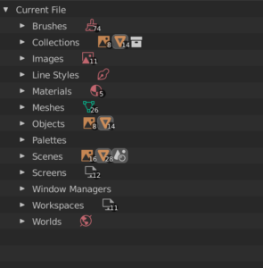

# 3D Model File Types

## A Crash Course In What You Need To Know

* What are 3d file types?
* Why do I want to know about them?
* How can I use these in a website?
* How can I use this in things like Unreal Engine?

### Introduction

* You might have heard of `FBX`, `OBJ`, `STEP`, `gITF`, `USD`, `USDZ` etc.
* Why do we want to settle on `.glb` and what do they all mean anyway?
* Is there one file type to rule them all?

## What is GLB? Is it any good?

`.glb` was developed by the `Kronos Group`. We don't pretend to be file-type historians, but each digital file format typically stems from certain organizations who are creating certain programs for specific purposes. They all come from different points in history and from different individuals, companies or organizations who created a file type that behaves and caters to them of their industry.

For example, `FBX` was made by `Autodesk (the creator of AutoCAD and other engineering/manufacturing industry software).` `FBX` is a popular 3D data interchange data used by 3D editors and game engines.

It was created as part of `Kaydara's Filmbox` motion capture took i.e "FilmBox.". A Software Development Kit (SDK) was released in 2005 which turned it from a private proprietary FX file format into a public file which `Autodesk` encouraged other people within the industry to start using.

Other popular 3D model and scene file formats include `Wavefront's` `OBJ` 3D format and the `Khronos Group` `glTF` 3D format.

## Which 3D File Format Is Best?

While lots of companies have made their own 3D file formats, at the end of the day, they are just file types. The best way to explain what it all means is to compare 3D file types to image file types which you'll be more familiar with.

Asking which 3D file format is better is the same as asking whether a JPEG is better than a PNG or TIFF of SVG or EPS. They all have their own different settings, inclusions, exclusions, pros and cons etc.

PNG tends to be favoured by Apple whereas JPEG is favoured by non-Apple users. SVG and EPS are vector files whereas JPEG and PNG are rasterized. PNG's support transparencies whereas JPEG does not.

## Why Use .glb

Mainly for the size and performance. GLB is great because you can have different images and settings all within the one single file container. It's called a file `container` because that container contains lots of other files and wraps it all up. For example, a .mp4 is a common video file format used natively by Youtube and many other video platforms which includes video files, a compression codec, audio files etc. A lot of different files are all wrapped up into this one file `container`. Depending on how you export the .mp4, the video can be good or bad quality. But using a container format means there's some consistency in terms of all the file elements that go into that container. For systems to show products in 3D we need to have multiple file elements present such as the `mesh`, colors, light refraction, animation etc.

## Advantages Of .glb

Unlike FBX, you don't have to upload images and meshes or textures separately because everything is included inside the container. When you compress the whole container that had these other elements already inside, the resulting file ends up being a lot smaller than compressing them all separately. This way, you save lots of spaced and don't have to have a folder with a million folders within it. Everything is just compressed together but still easy for other programs to access downstream like the ones we use within our system's architecture.

But within the 3D community, people prefer to use different software and systems and this is why some people will prefer some file types over others. Because they are more familiar with them. GLB and came the file size smaller and make it easier for the 3D visualization to work within an internet browser - especially on mobile. This way, textures don't need a separate upload.

## What Is Container inside of a GLB Container

Here's an example of things that can be contained within the glb container format. This is a screenshot from a Blender file.

So you'll have your actual physical, 3D object in the 3D space. The "Mesh" of the 3D model, which has no color data or texture, no shading. Think of it just like your shaped piece of clay you have before you paint it of the blueprints of a house.

Separately, you will have your image textures and materials that essentially just add the paint to your piece of clay.

You will have color texture or color map and sometimes called the `Diffuse` or `Albedo` map.

And then you would have Normal naps which determines the visual surface for the model including how light reacts to it. For example, human skin needs to have pores so a normal map would deter mine where the pores are and how deep they are.

